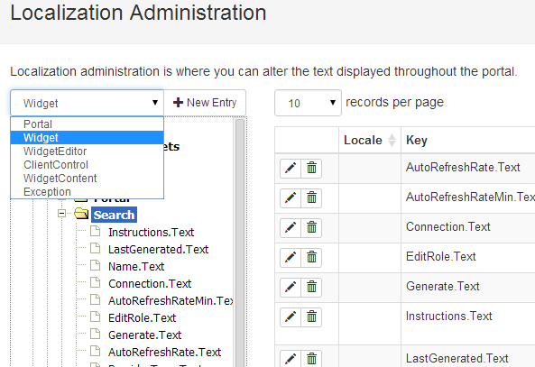

# Localization

Localization is a feature that most developers want to achieve in their products, but usually is a pain to implement.  Videre CMS tries to minimize this pain by making it almost as simple as putting in the default translation directly in their widget.  For example, when the following code is run for the first time the system will check to see if an existing entry is in the localization repository, and if so it will render it.  If not, the entry will be added.

``` csharp
@Model.GetText("NewBlog.Text", "New Blog")
```

The entries can easily be maintained via the Admin -> Localization widget.  Simply open the page, select the scope of Widget, click on the desired node, and all of its children will be rendered to the grid on the right.



Other translations can easily be added to the system by adding an entry with the same token and the desired locale and translated text.

While the code above will add an entry specific to the widget, there may also be cases where a more generic localization is warrented.  For example there is no reason that the Cancel button text should be specific to each widget.  In such cases, the following code may be used

``` csharp
@Model.GetPortalText("Cancel.Text", "Cancel")
```

This same pattern is used when coding against the Bootstrap FluentAPI.

``` csharp
Html.Bootstrap().Label("BlogName.Text", "Blog Name")
Html.Bootstrap().Button().Text("Ok.Text", "Ok", true)  //portal text
```