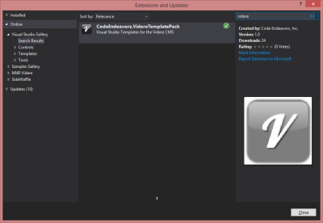
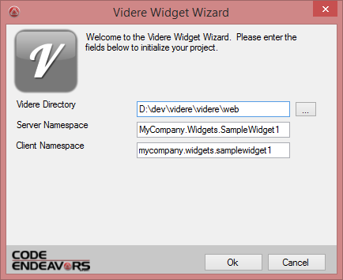

# Visual Studio Template

<IframeComponent src="//www.youtube.com/embed/srgScx69i6M" />

<IframeComponent src="//www.youtube.com/embed/5lDgELnHWoo" />

## About
Get up and developing quickly with the open source Videre CMS platorm by using this template. To install, simply use your Tools menu, then choose Extensions and Updates...  then search for videre

This package contains both a Project and Item templates for Visual Studio 2012 and later.  Additionally, there is a project wizard that enables your local videre website to be easily connected to your new widget for rapid development and debugging.

