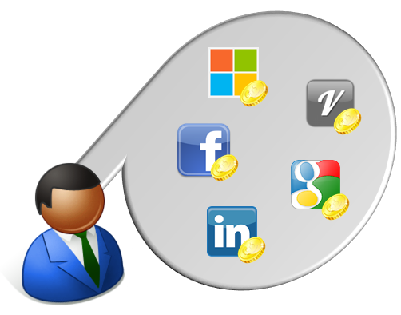

# Accounts and Authentication

## Accounts
A Videre user is composed of standard profile information (i.e. Email, Locale, TimeZone), a list of Roles, and a list of Claims.  A lot of systems treat roles as a claim as a claim simply has a couple more properties like Issuer and Type.  However, Videre will choose to treat them separate for the forseable future.  For more information on claims based authentication see [this video](http://vimeo.com/43549130).

## Authentication
The Videre CMS treats User Profile (Account) information separate from the User Authentication (user/password).  This allows a "videre user" to be associated to one or more modes of authentication.  A common scenerio in today's social world is to have a user associated himself with one or more OAuth providers like Facebook, Google, Microsoft Live, Linked-in, etc.  Even a user who has no OAuth provider associated, but rather uses the Videre standard authentication will be treated in the same manner.

Upon authentication a unique token is generated by the authentication provider and is stored on the user via a Claim where the Issuer is the Authentication Provider, the type is AuthenticationToken, and the value is the token.

## Authentication Providers
Authentication providers come in two types:  IStandardAuthenticationProvider and IExternalAuthenticationProvider

The standard interface requires the normal login type methods as is common to most systems.

The external interface is used to handle the special handshakes that OAuth requires. 

**Installation**: Authentication providers can be easily installed in a normal Videre package.  Once installed, they instantly become available as Videre will scan its dlls for classes implementing the interfaces

## Authentication Persistance
There are many cases where a system may wish to implement an authentication provider that does the verification to an outside system, but does not wish to allow Videre to do any of the persistance of the passwords.  This is why Videre also has another interface IAuthenticationPersistance.  

**Installation**:  Since it only makes sense to have a single active Authentication Persistance provider active, this is set up in the appsettings.config file.  The absense of any providers will cause the Videre UI to not allow the user to change the password.