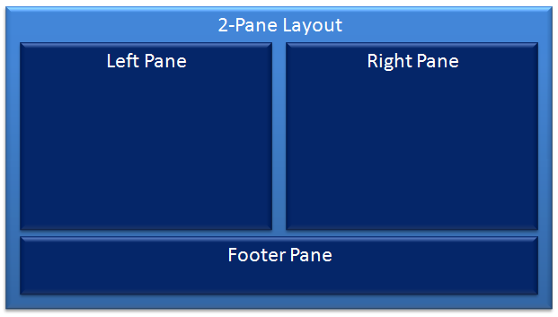
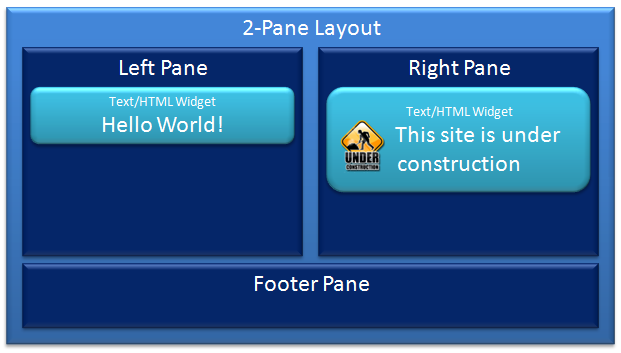
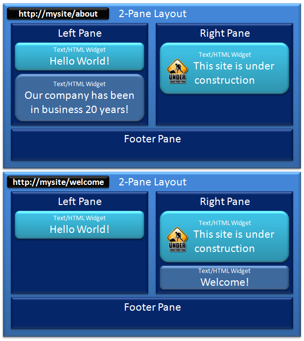

# Basic Definitions

## Basic Definitions for Components Within our CMS
When building any system, a common set of terms needs to be established in order to effectively provide information about how the system is designed.  This short help entry introduces the basic building blocks of our CMS system.

## Layouts and Panes
A layout defines one or more Panes.  Panes are containers that can hold widgets.  Examples of Layouts are 2-Pane, SidebarRight, and General.

Upon authentication a unique token is generated by the authentication provider and is stored on the user via a Claim where the Issuer is the Authentication Provider, the type is AuthenticationToken, and the value is the token.

## Widget
A widget is a component that can be placed within any defined pane.  Widgets are the main extensibility point of the CMS.  Some examples of widgets are Text/Html, Menu, Carousel, and help.

## Templates (Layout and Page)
A template is made up of widgets, including their content, which are assigned to a specific pane.  For example, we can have to Text/Html widgets defined within a template, each with different content.

Widgets can be added directly to a layout, and will therefore be seen on all places where that layout is used.  This is called a Layout Template.

There is another type of Template that includes additional filters for it to be displayed.  Page Templates typical filter for displaying is one or more Urls assigned to it.

The illustration shows 2 different Page Templates.  Both user the 2-Pane Layout that we defined earlier with our widgets.  The difference between them is that each has a different widget that shows up that is pulled from the page template.

***Note**:  Much thought was given to the name Page Template instead of just Page.  The reason for the inclusion of the word template is that the widgets that are contained within may be pulling additional context from the url.  A good example of this is a help.  The help widget will belong to a Page Template with a url of http://mysite/help.  However, it may accept additional information on it that will render the specific help entry.  This allows http://mysite/help/dogs and http://mysite/help/cats to point to the same Page Template, but will yield entirely different Pages.*

## Package
A package is a zip file containing one or more files that extend the functionality within a portal.  Examples of packages are updates to WebReferences (i.e. bootstrap, jQuery, etc.), exported portal content (pages, menus, layouts, etc.), providers (Authentication, Account, Bundlers, etc.), and Widgets (help, Carousel, etc.).  Packages typically contain a manifest file that explains what the package is for and where it came from (source).

## Web Reference
A web reference is an external reference that the browser makes to a file, typically a javascript of css file.  The abstraction by the Videre Core of a Web References allows the developer to simply ask to include a reference to a common name like jQuery UI and all the appropriate dependencies will be included automatically.