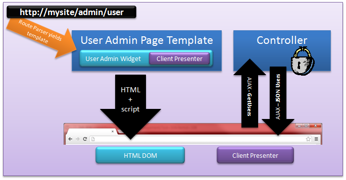

# Secure Resources

## Authentication Status
Security within our CMS is straight forward.  A user has one or more roles.  Roles can be used to restrict access to resources within the CMS.  Resources include: widgets, page templates, AJAX endpoints, and custom widget implementations like menu items.

One are of simplification is in the idea of an authenticated user.  Instead of making up a hard-coded role to represent a user as being authenticated, the CMS will expose an Authentication status of Authenticated, Not Authenticated, or None.

An example should help solidify our understanding.  Let’s say we have a requirement that we want to always show a generic message regardless of authentication status, show a user a login widget when the user is not logged in, and display a specific welcome message when the user is logged in.  We would specify our Authentication statuses as outlined in the diagram by the orange arrows.

In addition to specifying the Authentication status, the CMS also allows you to specify one or more roles to be set on the widget, restricting access to a user who has at least one of the roles.   The page templates also allow the same security checks as the widget, thus allowing for an entire page to be locked down to a specific set of users.

## Secure Activities
Most modern websites expose data through AJAX endpoints.  So far, we have discussed that it is possible to secure our page template url endpoints, but we have not mentioned how the endpoints that a widget exposes can be secured.  The following diagram outlines our concern.

Our browser requests the page template found at http://mysite/admin/user.  This can easily be secured by specifying an admin role to allow access to the page template.  The widget, however, uses several AJAX endpoints to allow data retrieval and persistence.  The url it uses is NOT the page template.  Typically it will be the namespace of the widget (i.e. http://mysite/widgetnamespace/controlername/methodname).  The controller does have access to the authentication ticket since it is a normal http request, but it does not know what role it should use to check against.  In fact, the developer of the widget will never know the role names, as those names are decided upon by the portal administrator.  This is where the need for a Secure Activity comes in.  A Secure Activity allows the widget to expose a name that defines one or more activities the widget can do.  Some examples may be:  help Writer, help Administrator, User Administrator, etc.  The CMS will expose a widget that allows the portal administrator to map his/her unique role names against the Secure Activities exposed by the widgets that are installed.  The following screenshot is a preview of the initial implementation of the Secure Activities within our soon-to-be-released CMS.

## AntiForgery Tokens / CSRF 
One of the most common security flaws on the web today is the Cross-Site Request Forgery.  The Videre core uses standard practices to mitigate the risk of this type of attack.  Each request by the browser will send down a AntiForgery token inside the javascript, additionally, it will send down a [HttpOnly cookie](https://www.owasp.org/index.php/HttpOnly) with the same token.  Upon calling any endpoint, this check will be performed unless specifically told not to.  To learn more about CSRF, I recommend this [blog entry](http://blog.stevensanderson.com/2008/09/01/prevent-cross-site-request-forgery-csrf-using-aspnet-mvcs-antiforgerytoken-helper/).
