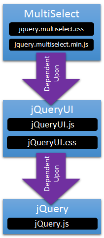
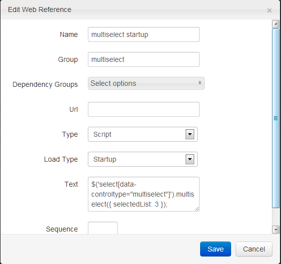

# Web References

## Organization of Client Dependencies with Web References
When creating a platform in which you want to encourage developers to utilized, it is imperative that the platform allows the developer concentrate as much as possible on solving the problem at hand, instead of trying to figure out how to get your framework working.  One aspect of this specific to web-development is the incorporation of third-party dependencies.  Javascript libraries like jQuery are quite common these days, so much so, that many libraries will build on top of jQuery.  As the web matures, there will not only be libraries dependent upon one other library, but ones that have multiple dependencies. Thus the following illustration is becoming more common.



Managing these dependencies, including the order in which they are included on the page cannot be something that is the widget developer’s responsibility.  There is no way the widget developer will know what other widgets are on the page.  Additionally, there is the problem of versioning of each file.  The widget developer should not have to specify a specific filename to include, as the version of the library may be updated.  Instead, a developer wishing to include the MultiSelect control should simply have to register the MultiSelect WebReference, and the framework (CMS) takes care of the rest.

``` csharp
Html.RegisterWebReferenceGroup("multiselect");
```

In this case we have 3 references:  the stylesheet (css), the jQuery plugin (js), and some initialization script. 

A Web Reference is composed of the following properties

* **Name** – a unique name to refer to the reference by
* **Group** – references that are usually registered together should belong to the same group
* **Dependency Groups** – the name of one or more groups that the reference depends on
* **Url** – for references that refer to a file (ScriptReference, StyleSheetReference), this is the location of that file (i.e. ~/scripts/myfile.js)
* **Type**
* **ScriptReference** – a js file
* **StyleSheetReference** – a css file
* **Script** – javascript found in reference text property
* **StyleSheet** – css found in reference text property
* **Load** Type
* **Inline** – loads in exact location on page rendering that it is registered
* **Defer** – loads reference in location specified by the layout, usually the &lt;head&gt;
* **Startup** – loads reference on document ready
* **EndStartup** – loads reference at very end of document ready
* **Text** – text for reference (css or javascript)
* **Sequence** – within a Group, the order in which the reference is loaded



Web references aims at solving a potentially complicated situation for the module developer with a rather simple solution, thus applying [Guiding Principles](guiding-principles.md) 1) Keep things simple 2) Keep things clean and 6) Minimize burden on developer.  There is room, however, for improvement, as this solution does not handle some of the more complicated scenarios like library versioning (i.e. required jQuery 1.4 or above) or individual file dependency (dependencies are only on group level).  